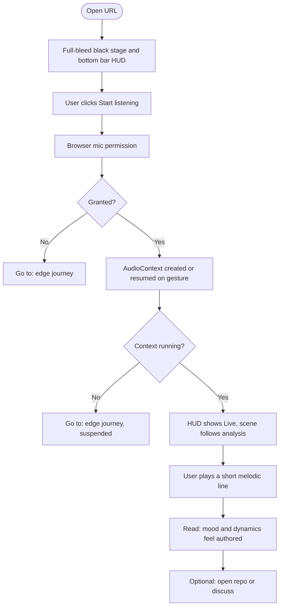
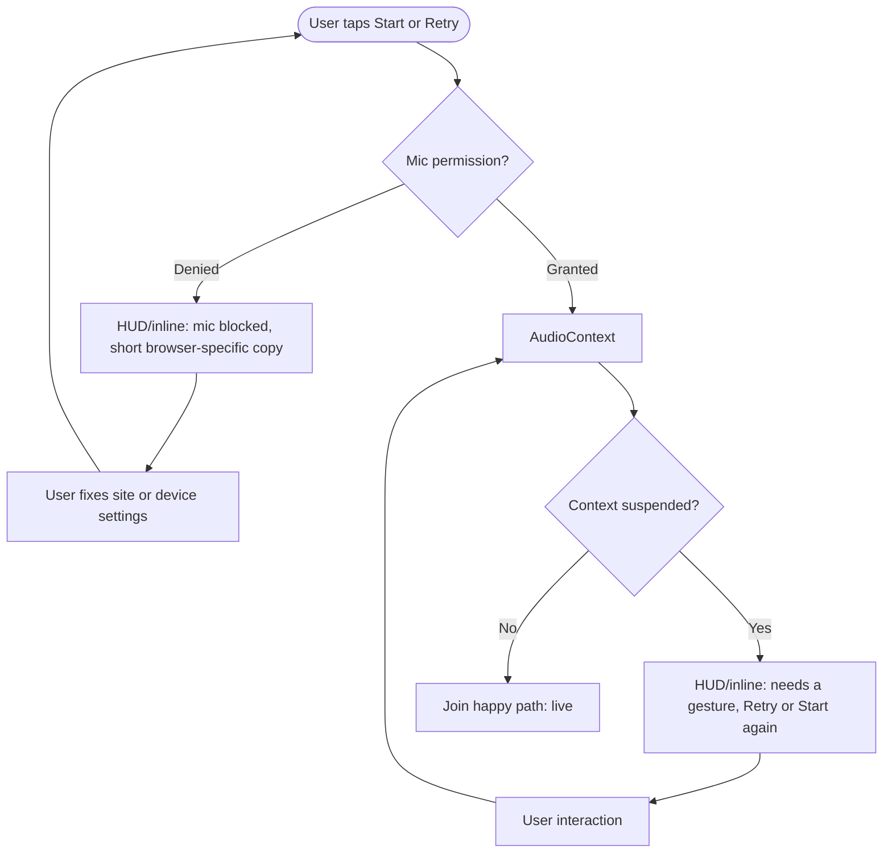

---
stepsCompleted:
  - 1
  - 2
  - 3
  - 4
  - 5
  - 6
  - 7
  - 8
  - 9
  - 10
  - 11
  - 12
  - 13
  - 14
lastStep: 14
uxDesignStatus: complete
inputDocuments:
  - _bmad-output/planning-artifacts/prd.md
  - _bmad-output/planning-artifacts/product-brief-visualize-music.md
  - _bmad-output/planning-artifacts/product-brief-visualize-music-distillate.md
---

# UX Design Specification visualize-music

**Author:** Adam
**Date:** 2026-04-27

---

## Executive summary

### Project vision

**visualize-music** is a **live** **mic**-driven **3D** **experience** for a **portfolio** **context**: **mood**-led **visuals** where **colour** tracks **tonal** **character** and **dynamics** drive **presence** in the **scene**, with **melody-first** **honesty** in **scope**.

**Visual & emotional direction (stakeholder):** The **world** should feel **mysterious** and **cinematic**—a **dark**, **contemplative** **stage**—while **motion** stays **pristine** and **clear** (legible, intentional, not chaotic). **Colour** is **punchy** and **saturated** **against** a **black** (or **near-black**) **background** so the **piece** **reads** as **bold** and **intentional** in **seconds**.

### Target users

- **Primary:** **Portfolio** **visitors** (e.g. **hiring** **managers**, **peers**) **judging** **taste** and **craft** in a **very** **short** **session**.
- **Secondary:** **You** as **author**—**deploy**, **record**, **explain** **scope** with **confidence**.
- **MVP** **assumption:** **Desktop**-**first**; **not** **optimised** for **small** **touch** **first**.

### Key design challenges

- **Mystery without opacity:** **Atmosphere** **must** **not** **sacrifice** **clear** **CTA**, **mic** / **AudioContext** **copy**, and **error** **recovery** (aligned with **PRD** **journeys**).
- **Motion quality:** **Animation** must feel **refined** and **readable**—**smooth** **transitions**, **obvious** **link** between **sound** and **motion**, **avoid** **muddy** or **nervous** **flutter** **unless** **intentional**.
- **Colour on black + accessibility:** **Punchy** **hues** on **black** for **impact**; **status** and **errors** still need **non**-**colour**-**only** **signals** where **required** by **FR17** / **NFR** **sensory** **rules**.
- **Performance:** **Rich** **visuals** must **respect** **desktop** **frame** **budget** and **“no** **chronic** **jank**” **expectations**.

### Design opportunities

- **Single** **black** **stage** as **default**—**one** **strong** **read** for **link** **previews** and **first** **impression**.
- **Dramatic** **but** **controlled** **motion** on **key** **moments** (e.g. **start** **listening**, **level** **swells**) to **sell** **mystery** **and** **quality**.
- **Colour** **as** **the** **hero** **variable** (with **dynamics** **driving** **weight**) **matches** the **product** **differentiator** and **stated** **aesthetic**.

## Core user experience

### Defining experience

The **core loop** is: **land** on the experience → **start listening** (with clear **mic** and **audio-context** handling) → **play melodic material** → **see** the **3D** stage **respond** so that **colour** and **weight** read as **tied to the music** at a glance. The interaction that must not fail is **“sound → visible, intelligible response.”** The world can feel **mysterious**; **controls, permission, and errors** stay **plain** and **recoverable** (per PRD journeys).

### Platform strategy

- **Web**: single URL, **client-side**-heavy; **MVP** is **desktop-first** (mouse and keyboard), not a native app.
- **No offline** requirement for the core demo; **mic** + **Web Audio** + **WebGL** assume a normal **browser** context.
- **Touch** on narrow viewports: **best-effort** only; not the MVP **primary** target.

### Effortless interactions

- A **single obvious** entry point that **unblocks audio** (user **gesture**) without hunting for **hidden** controls.
- **Clear, automatic** feedback when **blocked** (denied **mic**, **suspended** context): **what** failed and **how** to retry.
- **No** account or setup for the **core** demo.
- **Motion** should look **effortless** to the **viewer** (smooth, **intentional**), even when analysis is **imperfect** under the hood.

### Critical success moments

- **First 10–20 seconds:** black **stage**, **punchy** **colour** emerging, clear **start**—instant “this is a **designed** piece.”
- **First sustained** response to **live** **input:** motion that reads **reactive** and **clean**, not **random** or **laggy**.
- **When something fails:** **respect** for the work—**copy** + **retry** path, not a **dead** or **blank** **experience**.

### Experience principles

1. **Mystery in the atmosphere, not in the** **controls**—dark **theatre** for the **world**; **literate** **UI** for **state**.
2. **Pristine** **motion**—**every** transition **earns** its place; **avoid** **noise** that passes as **reactive** art.
3. **Punchy** **colour** on **black** as the **default** **look**; **neutrals** for **UI** that must **stay** **legible**.
4. **Readability of sound → form** first: **dynamics** → **presence**, **tonal** → **hue** (or the agreed **mapping**), then **embellishment**.
5. **Performance** is **UX**—dial **visual** **cost** before **jank** or a **broken** **illusion**.

## Desired emotional response

### Primary emotional goals

- **Wonder / intrigue** — a cinematic, intentional “stage” (not random gimmick as the only read).  
- **Awe at craft** — motion and colour feel authored: pristine, bold on black.  
- **Trust** — at mic/permission and errors: calm, plain, local-first framing.  
- **Respect** (evaluators) — a credible “this is designed” read inside the first minute.

### Emotional journey mapping

| Phase | Target feeling |
|--------|----------------|
| First land (0–5 s) | Hush and curiosity: black void with a punchy hint; one clear entry (no “where do I click?”). |
| Start / permission | Mild tension → relief when live; copy reassuring, not cutesy at the expense of clarity. |
| Core play | Absorption, flow, synesthesia-lite (“the sound is the light” without over-explaining). |
| Error | Clarity, not humiliation: next step obvious; don’t make the piece feel broken. |
| After | Satisfaction and a desire to share (portfolio). |

### Micro-emotions (prioritised)

- **Trust** over **skepticism** (mic, “what is this?”, privacy).  
- **Anticipation** over **anxiety** on first start (motion signals readiness, not “might break”).  
- **Clarity** over **bafflement** when the scene moves: if it animates, the *why* should read.  
- **Avoid:** irritable flicker or jitter, shamey or flippant error tone, uncontrolled glitch that reads as an accident.

### Design implications (emotion → UX)

- **Wonder** — slow or staged reveal, sparse copy, a vast black field; one clear hero visual metaphor.  
- **Punchy colour** on black for the show; restrained UI chrome (labels, errors) so the art stays legible.  
- **Pristine motion** — consistent easing, bounded energy; no nervous jitter unless it is musically and visually intentional.  
- **Trust** on error — short text, icon, contrast; not colour alone for critical state.

### Emotional design principles

1. **Mystery in mood, not the maze** — world feels deep; system state (mic, audio, errors) stays legible.  
2. **Restraint as luxury** — fewer, stronger motion beats; “enough but not more.”  
3. **Colour = tonal character; weight = dynamics** — that read should work at first glance.  
4. **Respect the player** — the UI does not condescend, even when something goes wrong.  
5. **Failures are handled, not hauntings** — mysterious on the outside; human, clear, recoverable in copy and affordances.

## UX pattern analysis and inspiration

*No specific “favourite apps” were named in-session; this section is pattern-based. Stakeholder may add 2–3 named products later.*

### Inspiring products analysis (illustrative)

| Reference (illustrative) | What we borrow (pattern, not an endorsement) |
|--------------------------|-----------------------------------------------|
| Full-bleed dark “creative” tools (DAW meter clarity, pro dark UIs) | One main **stage**; **chrome** recedes; **state** is readable in small, stable HUD affordances. |
| Museum / installation interactives | Cinematic pacing; one clear **begin**; room to breathe before the “show” runs. |
| High-end generative or audio-reactive work | Punchy colour on black; motion that reads **intentional**, not like a render bug. |
| Strong browser mic experiences (well-designed permission) | Short **why** for the mic, plus a plain **we don’t upload** line aligned with the PRD. |

### Transferable UX patterns

- **Full-bleed black canvas + minimal UI chrome** — supports mystery and punchy hues; matches desktop-first MVP.  
- **Single primary** “Start / listen” (or equivalent) with distinct idle → live states.  
- **State ladder:** idle → permission → live → (optional) error, each with distinct, legible treatment (journeys + FRs).  
- **Two layers:** **stage = expressive;** **HUD / toasts =** high-contrast, small, stable (trust + accessibility for status).  
- **Easing language:** smooth, bounded; “pristine” = no nervous jitter at rest (unless the musical mapping deliberately drives it).  

### Anti-patterns to avoid

- **Default** “disco” spectrum-bar look as the only read (generic, muddy midtones, no sense of a **piece**).  
- **Neon on noise** — visual fatigue; fights *mysterious* + *punchy*.  
- **“Glitch”** as the error treatment unless it is clearly deliberate **and** recoverable with explanation.  
- **Snarky** error copy for browser-side failures (cheapens a portfolio work).  
- **Static chrome** crowding the black void before the experience has begun (kills the **first-land** hush).  

### Design inspiration strategy

- **Adopt:** full-bleed dark stage, one clear on-ramp, explicit permission + error paths, two-layer (stage vs system UI) separation.  
- **Adapt:** pro-tool **clarity** of state and metering, slimmed to **portfolio** scope (far fewer controls than a DAW).  
- **Avoid:** generically trippy look without a **readable** sound→visual mapping; accidental-looking jitter; cute or opaque failures.  

## Design system foundation

### 1.1 Design system choice

**Hybrid: utility-first CSS for chrome, custom Three.js for the stage, minimal accessible primitives (exact stack TBD).**

- **Chrome (HUD, layout, type, spacing, tokens):** **Tailwind CSS** or an equivalent **utility-first** layer—thin, themeable, dark by default, semantic state tokens.  
- **3D world:** custom **Three.js** (not a UI kit). Visual language (colour ramps, motion) should **align** with the same design tokens at the boundary between **stage** and **UI**.  
- **With React:** headless primitives (e.g. **Radix** UI) sparingly—button, dialog, focus—not a full **Material** or **Ant** shell. **Without React:** lean native markup + a11y patterns, minimal dependencies.

**Not chosen as the primary visual system:** off-the-shelf **Material** or **Ant** defaults—they read corporate and work against a cinematic, mysterious brand.

### Rationale for selection

- **Speed and control:** utilities make a **small** UI fast to tune; **differentiation** lives in the **scene** and the **audio→visual mapping**, not in bespoke form controls.  
- **A11y where it matters** (PRD FR/NFR): headless or careful components for **focus**, **contrast**, **modals** when used.  
- **Performance:** avoid heavy all-in UI frameworks for minimal chrome; keep main-thread budget for audio + rAF + WebGL.

### Implementation approach

- Central **design tokens** (background, text, accent, danger, radius, duration, easing), e.g. Tailwind theme or CSS variables.  
- Small **component** set: primary CTA, text link, inline/toast for errors, optional short help for mic.  
- **WebGL** layer: separate build of geometry/materials, **shared** contrast and motion restraint with chrome.

### Customization strategy

- **Stage:** fully custom—mysterious mood, **punchy** colour on **black**, **pristine** motion (per prior sections).  
- **Chrome:** restrained, high-contrast, **low** chroma so it never competes with the 3D colour story.  
- **Framework (React vs not)** is an implementation choice; this document stays at pattern level.

## 2. Core User Experience

*This section deepens the defining interaction, mental model, and mechanics. The high-level frame remains under [Core user experience](#core-user-experience) above.*

### 2.1 Defining Experience

**The one-line promise:** *What you play into the mic becomes a living 3D stage—colour and weight follow the music in a way you can read at a glance.*

**What users might say to a friend:** “It’s a dark, cinematic **browser** thing—you play, and the room **lights and moves** with the sound; the colours are **bold** on **black**.”

**The single non-negotiable:** If we get only one thing right, it is a **legible, beautiful** real-time **audio → visual** mapping on a **mysterious** black **stage**, with no mystery in **mic permission**, **AudioContext**, or **error** state: plain copy and clear recovery (PRD journeys).

### 2.2 User Mental Model

- **How they solve the problem today:** DAWs for metering and tools; separate visualizers or “music video” look-alikes. Here they want **one tab** + **instrument** + **mic**—a **portfolio piece**, not a full production workflow.
- **Mental model they bring:** “Sound should *do* something *visible*.” They expect **latency** to break the **illusion**; without reassurance they may **assume** upload or creep (PRD: local-first **framing** in copy).
- **Expectation:** A **gesture** unlocks **audio**; when it is working, the **stage** should **obviously** breathe with input; when it is not, they should know **why** and **what to try** next.
- **Confusion and frustration:** **Suspended** AudioContext with no signal; **denied** mic with no path; **jitter** or **random** motion that reads as a **bug** rather than intentional art.

### 2.3 Success Criteria

- **“It just works”** — After the user’s gesture, live input maps to visible response **fast** enough to **feel** tied to playing (per PRD NFR; exact numbers are implementation).
- **Pride and clarity** — Louder/ softer and tonal / register shifts read as bigger / brighter / warmer (or the agreed mapping), not arbitrary flicker.
- **Obvious feedback** — A discernible **live** state; stage **energy** tracks **playing**; **errors** use inline or HUD treatment with contrast and non–colour-only cues where FRs require it.
- **Automation where it helps** — Retry or resume paths for common browser audio blocks (where possible), without hiding the real failure mode.

### 2.4 Novel UX Patterns

- **Established patterns we lean on:** mic permission, full-bleed dark canvas, one primary CTA, toasts or inline errors, desktop-first mouse/keyboard (MVP).
- **What’s novel:** The **exact mapping** (mood-first, melody-first, piano-leaning) is the product. We teach by **showing**—no long tutorial; the first seconds sell the read.
- **Metaphors:** Theatre / lighting on a void; [Experience principles](#experience-principles) already state **mystery in the world, not in the controls**—this section applies the same idea to *pattern* choice.

**Innovation without confusion:** The unfamiliar part is *our* aesthetic and mapping, not **hidden** affordances for start, stop, or error.

### 2.5 Experience Mechanics

| Phase | What happens |
|--------|----------------|
| **1. Initiation** | User lands on a URL: black full-bleed **stage**; one obvious path to “listen” / start; optional short line that analysis is local to this tab. |
| **2. Interaction** | Gesture (click/tap) requests the mic and unlocks Web Audio; user plays; analyser output drives the **Three.js** scene (colour and dynamics per agreed model). |
| **3. Feedback** | “Live” is visible in a small **HUD** and in the **stage** (dynamics → presence/weight, tonal → hue or agreed stand-in). On failure: plain message, retry, accessible cues. |
| **4. Completion** | Demo-style: no mandatory *end* flow. User stops playing or leaves. Optional pause/mute if in PRD scope. |

## Visual Design Foundation

*No separate brand book was provided; this aligns with the product brief and PRD (black stage, punchy accents, legible chrome).*

### Color System

- **Stage / world:** default **background** in the **near-black** range (`#0a0a0a`–`#000000`); avoid low-contrast grey-on-black for text that must read.
- **Accent / expression:** **punchy, saturated** hues for the 3D read (mood/tonal mapping); use a small **token** set (e.g. warm, cool, peak for dynamics) and **ramps**—exact values are implementation.
- **Chrome (HUD, labels, errors):** **restrained** neutrals (off-white / muted grey on black or a very dark surface); **one** clear **primary** CTA accent that does not compete with the **stage** hero colours.
- **Semantic UI:** **danger** / **blocked** / **live** (if in UI) get **dedicated** tokens; pair with **icon** and **text**, not colour alone, where PRD/FRs require.
- **Accessibility:** HUD and **interactive** chrome target WCAG-oriented contrast; the art layer can be expressive but must not be the *only* channel for permission-denied or error (per PRD).

### Typography System

- **Role:** **short** strings only—labels, errors, mic copy, optional legal link—not long reading.
- **Tone:** **modern, neutral, confident**; no playful display face for system strings (mystery lives in the **world**, not the **font**).
- **Stack:** system UI stack or one variable web font (e.g. Inter, IBM Plex Sans) for crisp small sizes; **one** family for chrome.
- **Scale:** compact for HUD (e.g. 12–14px UI body, one step up for rare panel titles); line-height sufficient for error lines and accessibility.
- **3D “type”** is not a second type system—**motion** and **colour** carry the art.

### Spacing & Layout Foundation

- **Base unit:** 4px or 8px—pick one and use consistently; 8px default for component padding on chrome.
- **Stage:** full-bleed; **HUD** in a **single** **zone** (e.g. bottom bar, top bar, or corner) with **generous** inset from viewport edges so the **void** reads.
- **Density:** **airy** on the main canvas; **tighter** only in optional modals (error, help).
- **Grid:** no strict marketing grid on the 3D view; a 12-col or max-width grid applies only if future landing or footer content is added (out of MVP core path).

### Accessibility Considerations

- **Visible focus** on all chrome controls; tab order: primary CTA → secondary → dismiss / links.
- **Status** not by colour alone for blockers; redundant text or icon + label where the PRD requires.
- **Motion:** respect `prefers-reduced-motion`: reduce or dampen non-essential scene motion; keep a legible simplified or static read when the preference is on.
- **Touch (best-effort):** larger hit targets if narrow viewports matter; **MVP** remains desktop-first.

## Design direction decision

Exploration file: `_bmad-output/planning-artifacts/ux-design-directions.html` (six static layout directions on a shared black “stage” mock).

### Design directions explored

| # | Name | Gist |
|---|------|------|
| 1 | Bottom bar | Full-width HUD: status + primary CTA; pro-tool, desktop-first. |
| 2 | Top strip | Title/brand + state + CTA; maximum void under the “sky.” |
| 3 | Corner stack | Compact floating card; stage reads largest; watch small-viewport overlap. |
| 4 | Center pill | Minimum chrome; pair with plain error surfaces so failures never vanish. |
| 5 | Left rail | Vertical “wing” of controls; validate tab order and narrow widths. |
| 6 | Top status + bottom CTA | Splits read-only state from action; room for help/privacy without duplicating the primary row. |

### Chosen direction

**Direction 1 — bottom bar** is the **baseline** for MVP: one stable strip for idle/live and **Start listening**, familiar pro-creative feel, and alignment with *mystery on the stage, legible chrome* (product brief / earlier sections).

**Alternative:** **Direction 6** if the stakeholder wants **state** (top) and **actions + links** (bottom) separated from day one.

### Design rationale

- **Differentiation** lives in the **Three.js** stage and **audio → visual** mapping, not in experimental HUD chrome for the **primary** path.
- A **bottom bar** matches the **full-bleed dark + minimal UI** pattern from the inspiration section and leaves the **void** uncluttered before play.
- **Extensible** without center-crowding: version string, help, or a short line can sit in the strip or an adjacent **inline** / **modal** pattern.

### Implementation approach

- Build the chrome as a **full-width bottom HUD** (tokens from [Visual design foundation](#visual-design-foundation)) with a **full-bleed** container above for **Three.js**.
- **Errors** and **blocked** states: inline in the bar and/or a small panel—never the only signal on an ultra-minimal center-only control (if Direction 4 were ever adopted, pair it with explicit failure surfaces).
- **Optional** spike: **Direction 6** in a branch if split top/bottom is required before launch.

## User journey flows

Narratives align with the PRD user journeys. **Bottom-bar HUD** (Design direction) is the default chrome layout. **You** and **River** are **not** a separate in-app product—**ship, README, and repo** (PRD).

### Sam — peer / hiring (happy path)

**Goal:** In about one minute: clear CTA → mic → short melodic play → **intentional** colour and weight (not a generic visualiser read).

**Flow:**

**Success notes:** Time-to-wonder; obvious first run; positioning is **not** “tuner” or “notation product” (PRD). **Audio → visual** should feel **immediate** in review (not multi-second lag).

### Sam — edge (mic blocked or audio not starting)

**Goal:** Plain **what** failed and **what** to do; **retry** without hunting for a hard refresh; user leaves with **clarity** over **blame** (PRD).

**Flow:**

**Notes:** **Icon + text** (not colour alone) for blocked and suspended; copy matches **real** **browser** behaviour. Recovery target ~**half a minute** when **possible** (PRD).

### You — author / maintainer (ship and story)

**Goal:** **Deploy** (e.g. static host), **rehearse** a line that **matches** the **code** and **stated** **limits** (mood-first, **melody-first**; no overclaim on **pitch** / **polyphony**).

- **Flow:** `build` → **deploy** → **smoke** the live URL (HTTPS for mic) → **walkthrough** (live or recorded) with **honest** **scope** in the **story**; **README** covers install, run, what it is and is not, known **limits** (PRD).  
- **No** separate **in-app** **admin** or **help** product.

### River — developer (clone the repo)

**Goal:** **Clone** → **run** **locally** in **minutes**; **trace** `mic` → `analysis` → `render` in the **codebase** (PRD).

- **Flow:** Clone → **README** **quickstart** → dev **server** (localhost / HTTPS for mic) → find **entry** and **seams** between **Web Audio** and **Three.js** (or agreed render path).  
- **Success:** Reproducible run and **legible** **boundaries** between **audio** and **visual** **layers** (Journey requirements summary, PRD).

### Journey patterns

- **Single** primary CTA; the bottom bar holds idle / live and the Start / Retry path ([Design direction decision](#design-direction-decision)).  
- Narrative order: hush on the **stage** → **permission** → **running** AudioContext → **live**; blockers use the strip or a small surface, not a separate “second app” feel. **Recovery** always offers a **concrete** next step: settings, gesture, or **Retry** (PRD).

### Flow optimization principles

- **Time-to-wonder** after **mic** allowed and **context** running is **as short** as **practical** (Sam’s total window is on the order of a minute, including the read).  
- **One** main decision at a time: start, fix, or retry. **Idle ↔ live** and **stage** energy must be unmistakable when the pipeline is **working** (per [Core user experience](#core-user-experience) and [section 2 details](#2-core-user-experience)).  
- **Errors:** no blank or unexplained silence; no snarky error tone (PRD journeys and emotional goals). **Motion:** respect [Accessibility considerations](#accessibility-considerations) in [Visual design foundation](#visual-design-foundation) and `prefers-reduced-motion`.

## Component strategy

### Design system components

- **Utility layer** (e.g. Tailwind): layout, spacing, typography, colour tokens, borders, and focus styles for the **chrome** layer ([Design system foundation](#design-system-foundation)).  
- **Optional headless primitives** (e.g. Radix) if the stack is React: **button**, **link**, **dialog** for Help and longer error copy—**not** a Material / Ant default shell.  
- **Out of the box** from that stack: basic **button** and **text** patterns, **flex** / **grid** layout, **modal** shell when a short bar is not enough for copy.

### Custom components

**1. Stage (WebGL / Three.js)**  
- **Purpose:** Full-bleed 3D “theatre” driven by real-time analysis.  
- **Anatomy:** WebGL root, camera, scene, materials/shaders; post-processing optional.  
- **States:** idle (subtle or static); **live** (reactive to analysis); **reduced motion** (simpler or damped motion, per [Accessibility considerations](#accessibility-considerations)).  
- **Accessibility:** Decorative presentation or `role="img"` with a short `aria-label`; all real actions stay in the HUD.

**2. Bottom HUD bar**  
- **Purpose:** System state (idle / permission / **live** / error), primary CTA (Start / Retry), optional version or Help ([Design direction decision](#design-direction-decision)).  
- **States:** idle; awaiting permission; **live**; error (inline in the bar or an expanded row).  
- **Accessibility:** Label the control region; tab order: primary CTA, then secondary; status not by colour alone (PRD / [Visual design foundation](#visual-design-foundation)).

**3. Blocker / error surface**  
- **Purpose:** Plain copy for denied mic, suspended AudioContext, or other recoverable failures ([User journey flows](#user-journey-flows), Sam edge).  
- **Pattern:** Same bar with more text, or a small **dialog** if copy is long (desktop).  
- **Accessibility:** Move focus to the message or **Retry**; **Retry** and dismiss work from the keyboard.

### Component implementation strategy

- Build the HUD with **design tokens** only; keep the WebGL **stage** in separate modules (scene, render loop, **analysis → scene state**).  
- No DOM inside the canvas; align **stage** and **chrome** at the **edge** with shared tokens and motion **principles** only.  
- Document a **thin, traceable** contract from analysis to render (types or clear module boundaries) for the **River** journey (PRD).

### Implementation roadmap

- **Phase 1 (MVP):** Bottom HUD, Stage, blocker/error path; **Start** / **Retry** end-to-end for Sam.  
- **Phase 2:** Optional Help or legal one-pager (dialog or route); optional metering-style readouts in the HUD.  
- **Phase 3 (post-MVP, PRD growth):** Presets, export, wider browser work—out of v1 **core** scope.

## UX consistency patterns

### Button hierarchy

- **Primary:** **Start listening** or **Retry** when the audio path failed—one clear accent from tokens, **visible** focus, hit target suitable for desktop-first MVP (mouse first; see [Additional patterns](#additional-patterns) for touch).  
- **Secondary:** text-style **Help** or short legal link—**low** chroma; must not out-shout the primary on first land.  
- **Dismiss** on modals uses **secondary** or **plain** text next to **Retry** on error; no **destructive** pattern in v1 (nothing to delete).

### Feedback patterns

- **Live / success:** **HUD** shows a **Live** (or equivalent) state with **icon + label** (not colour alone). The **stage** reinforces that input is being **heard** ([Core user experience](#core-user-experience)).  
- **Error / blocked:** Same family as the **Blocker / error** pattern in [Component strategy](#component-strategy): short headline, one recovery action, browser-accurate copy for mic and **AudioContext**. No dismiss-only path on hard blockers.  
- **Warning** (e.g. “very quiet input”): optional in MVP; if used, **neutral** copy—no snark ([Desired emotional response](#desired-emotional-response)).  
- **Info:** **rare**; a single line in the bar or a **Help** link—no notification spam.

### Form patterns

- **MVP core:** no required **forms** (no login, search, or settings as part of the core path).  
- **Phase 2:** optional read-only **Help** / **legal** view in a **dialog** or **route** ([Implementation roadmap](#implementation-roadmap))—scannable text, no fake “submit” for core demo.

### Navigation patterns

- **Single-page** experience: land → start / recover (see [Web app specific requirements in the PRD](prd.md#web-app-specific-requirements)). No hamburger, no in-app tabs in MVP. External navigation: **README** / **repo** for the **River** journey.

### Additional patterns

- **First land / empty:** black **void** and **one** primary—see [Design inspiration strategy](#design-inspiration-strategy) and [Anti-patterns to avoid](#anti-patterns-to-avoid).  
- **Loading** (bundle or resuming audio): keep it **sparing**—indeterminate state or short copy in the **HUD**, not a heavy skeleton on the **stage**.  
- **Permission** framer: short **local**-processing line; no dark patterns ([User journey flows](#user-journey-flows), PRD **trust**).  
- **Touch (best-effort):** on narrow viewports, keep the **primary** CTA tappable and **unobstructed**; **MVP** remains **desktop**-first ([Platform strategy](#platform-strategy)).

## Responsive design and accessibility

### Responsive strategy

- **Desktop (MVP, primary):** One full-bleed **stage** and a **bottom** HUD—no second column or dense tool chrome. Extra horizontal space stays **void**; the 3D view is the **hero** surface ([Platform strategy](#platform-strategy), [Design direction decision](#design-direction-decision)).  
- **Narrow and tablet (best-effort):** The bottom bar may wrap to a second line; the **primary** CTA must stay **visible** and **tappable** (PRD: narrow viewports still show a **usable** primary path).  
- **Phone:** **Not** mobile-first for polish; if opened on a small screen, **Start** / **Retry** and error copy must still be **reachable** and **readable** (same PRD point).

### Breakpoint strategy

- **Reference layout:** “Desktop” in the PRD sense (current **Chrome** on a typical **laptop** as the main target).  
- **No rigid grid** for the 3D layer; use utility-first CSS and manual checks at ~1280px, ~768px, and ~390px for wrap, padding, and no clipped controls.  
- **When to change layout:** if the HUD would push body text below a readable size, stack the bar or increase its height before hiding the primary CTA.

### Accessibility strategy

- **Chrome and controls:** Target **WCAG 2.1 Level AA** for contrast and focus on text and controls in the HUD (see [Visual design foundation](#visual-design-foundation) and the PRD *Accessibility level*).  
- **The WebGL stage** is expressive; **blockers** and **status** live in the HUD with **text + icon** (or equivalent), not colour alone ([Feedback patterns](#feedback-patterns), PRD).  
- **Keyboard:** cover **Start**, **Retry**, and **dismiss**; order **primary → secondary** ([Button hierarchy](#button-hierarchy)).  
- **Motion:** respect `prefers-reduced-motion` with simpler or damped scene motion, or a static or low-amplitude read ([Accessibility considerations](#accessibility-considerations), [Stage](#custom-components) in [Component strategy](#component-strategy)).

### Testing strategy

- **Reference browser:** current **Chrome** on **desktop** for MVP ([PRD browser matrix](prd.md#browser-matrix)). **Stretch:** recent **Firefox**, **Safari**, **Edge** (best-effort).  
- **Responsive:** resize the window; spot-check a narrow width so the bottom bar and CTA remain usable.  
- **Accessibility:** keyboard-only run of the primary and error paths; automated checks (e.g. Axe or Lighthouse **accessibility**) on the chrome layer; short **screen reader** pass on the HUD (e.g. **VoiceOver** on macOS or **NVDA** on Windows).

### Implementation guidelines

- **Layout:** `rem` / `%` for the bar; full-bleed stage using `100vw` and `100dvh` (or `100vh` with care for mobile browser UI).  
- **Semantics:** a landmark or `role="region"` for the HUD; `aria-live="polite"` or `assertive` for dynamic error text when screen reader users need to hear updates.  
- **Do not** put system state only on the `<canvas>` `aria-label`—keep **live / blocked** state in the bar.

<!-- BMad: create-ux-design workflow complete (step 14). -->
